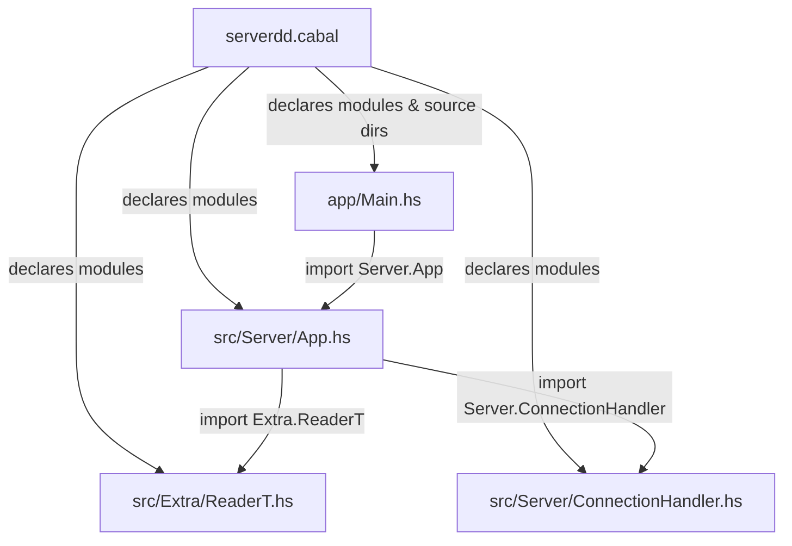
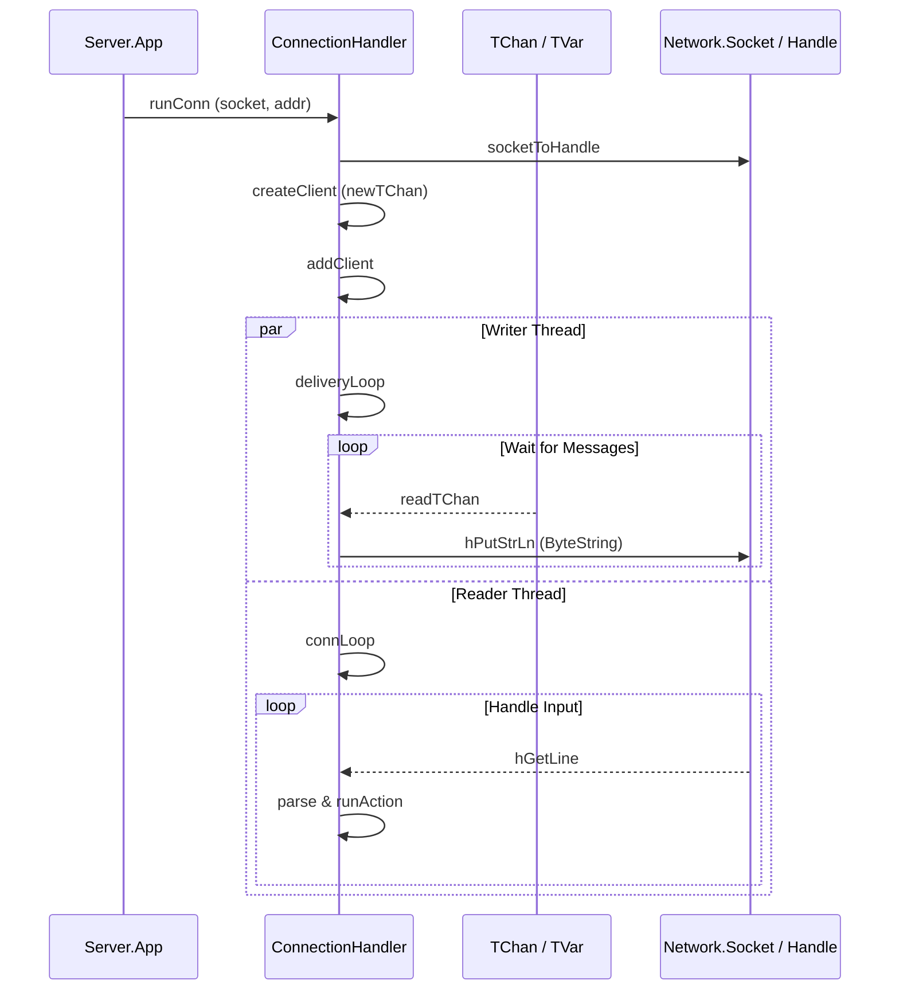

# serverdd — File Relations (Haskell)

> A Haskell TCP server for a chat.

## Project Layout

```
server/
├── server.cabal          ← Build config, declares modules & dependencies
├── server/
│   ├── app/
│   │   └── Main.hs         ← Entry point
│   └── src/
│       ├── Server/
│       │   ├── App.hs      ← Core application logic & types
│       │   └── ConnectionHandler.hs  ← Per-connection I/O
│       └── Extra/
│           └── ReaderT.hs  ← Custom ReaderT monad transformer
```

## File Dependency Graph



## File-by-File Breakdown

### `serverdd.cabal`

| Role | Build manifest |
|------|---------------|
| **Declares** | `Main.hs` (entry), `Server.App`, `Server.ConnectionHandler`, `Extra.ReaderT` |
| **Source dirs** | `serverdd/app` (for `Main.hs`), `serverdd/src` (for library modules) |
| **Dependencies** | `base`, `network`, `mtl`, `transformers` |

---

### `app/Main.hs`

| Role | Application entry point |
|------|------------------------|
| **Module** | `Main` |
| **Imports** | `Server.App` — uses `Env`, `defaultSocket`, `runApp`, `runServer` |

Creates an `Env` with the default socket configuration, then runs the server inside the `App` monad via `runApp`.

---

### `src/Server/App.hs`

| Role | Core application types and server lifecycle |
|------|---------------------------------------------|
| **Module** | `Server.App` |
| **Exports** | `App(..)`, `Env(..)`, `runApp`, `runServer`, `defaultSocket` |
| **Imports** | `Extra.ReaderT` — uses the custom `ReaderT` as the underlying monad transformer |
|             | `Server.ConnectionHandler` — calls `runConn` to process accepted connections |
|             | `Network.Socket` (external) — socket primitives |
|             | `Control.Monad.Reader.Class` (external) — `MonadReader`, `asks` |
|             | `Control.Monad.IO.Class` (external) — `MonadIO`, `liftIO` |

**Key types:**
- `App a` — a newtype over `ReaderT Env IO a`, deriving `Functor`, `Applicative`, `Monad`, `MonadReader Env`, `MonadIO`.
- `Env` — holds a `SocketConfig` record.
- `SocketConfig` — family, type, protocol, and address for the socket.

**Key functions:**
- `runApp` — unwraps `App` and runs the `ReaderT` with a given `Env`.
- `runServer` — builds a socket → starts listening → enters `mainLoop`.
- `mainLoop` — accepts a connection, delegates to `runConn`, and recurses.

---
### `src/Server/ServerTypes.hs`

| Role | Shared server data types |
|------|--------------------------|
| **Module** | `Server.ServerTypes` |
| **Key Types** | `Client`, `Room`, `Messages` (ByteString) |

**Key structures:**
- `Client` — stores user metadata, their connection `Handle`, and `clientChan` (`TChan Messages`).
- `Messages` — alias for `ByteString`, ensuring efficient binary-safe communication.
- `Room` — manages participants and ownership.

---

### `src/Server/ConnectionHandler.hs`

| Role | Handles a single client connection with dual-thread I/O |
|------|------------------------------------|
| **Module** | `Server.ConnectionHandler` |
| **Exports** | `ConnHandler(..)`, `runConn` |
| **Key Monads** | `ConnHandler` — `newtype` over `ReaderT HandlerEnv IO` (implements `MonadUnliftIO`) |

**Concurrency Model (Reader/Writer):**
- **Reader Thread (`connLoop`)**: The main connection thread. It reads user input from the `Handle` via `hGetLine`, parses it, and executes actions.
- **Writer Thread (`deliveryLoop`)**: Forked upon client connection. It waits for messages in the `clientChan` (`TChan`) and writes them to the `Handle` using `hPutStrLn`.

**Key functions:**
- `runConn` — initializes the connection, creates the client, and starts the loops.
- `createClient` — initializes a new `TChan` and builds the `Client` record.
- `addClient` — registers the client and forks the `deliveryLoop`.
- `runSTM` — helper to run `STM` actions within the `ConnHandler`.

---

### `src/Extra/ReaderT.hs`

| Role | Custom `ReaderT` monad transformer |
|------|-------------------------------------|
| **Module** | `Extra.ReaderT` |
| **Exports** | `ReaderT`, `runReaderT`, `ask`, `lift` |
| **Imports** | `Control.Monad.Reader.Class` (external) — `MonadReader` typeclass |
|             | `Control.Monad.Trans.Class` (external) — `MonadTrans` typeclass |
|             | `Control.Monad.IO.Class` (external) — `MonadIO` typeclass |

Provides a from-scratch `ReaderT` implementation with instances for `Functor`, `Applicative`, `Monad`, `MonadReader`, `MonadTrans`, and `MonadIO`.
> [!NOTE]
> `ConnectionHandler.hs` utilizes a `ConnHandler` monad built upon the custom `Extra.ReaderT`. To support the dual-thread model, `Extra.ReaderT` has been extended with a `MonadUnliftIO` instance.

## High-Level Data Flow


