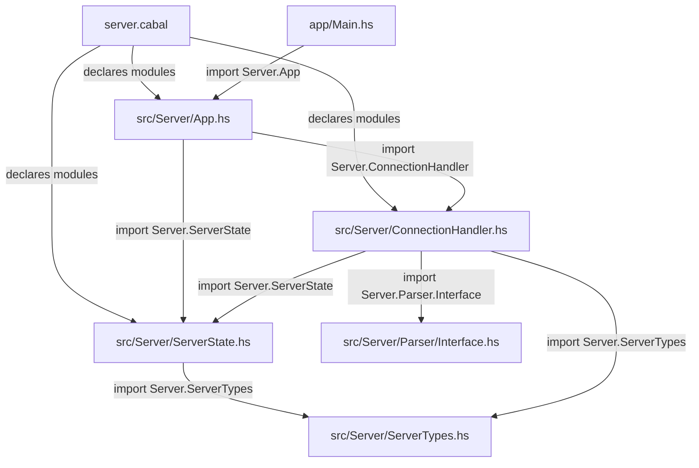
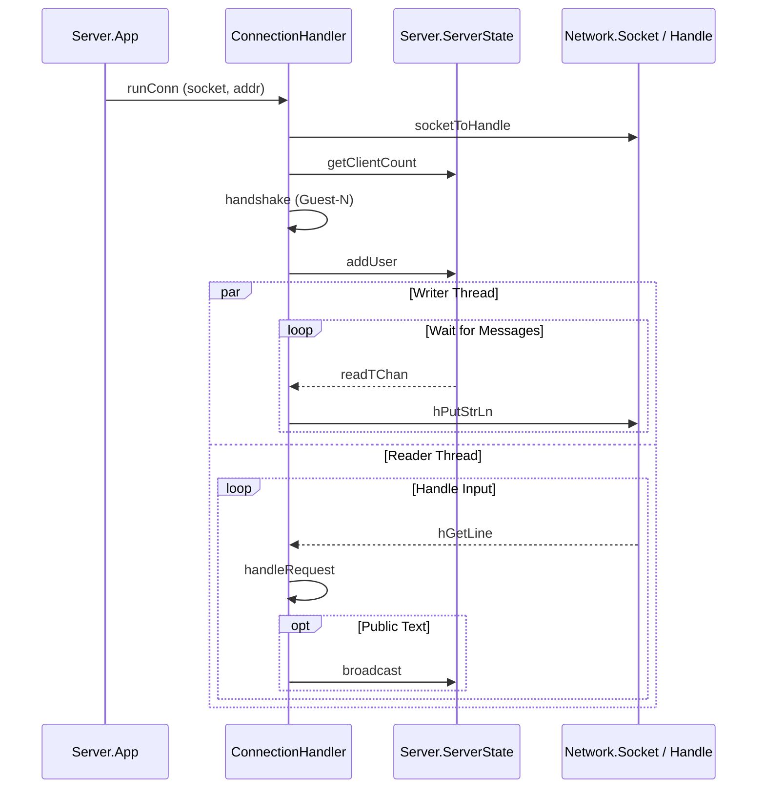

# serverdd — File Relations (Haskell)

> A Haskell TCP server for a chat.

## Project Layout

```
server/
├── server.cabal          ← Build config, declares modules & dependencies
├── server/
│   ├── app/
│   │   └── Main.hs         ← Entry point
│   └── src/
│       └── Server/
│           ├── App.hs      ← Core application logic & server lifecycle
│           ├── ConnectionHandler.hs  ← Per-connection I/O and request handling
│           ├── ServerState.hs ← Global server state and STM actions
│           ├── ServerTypes.hs ← Shared data types (Client, Room, etc.)
│           └── Parser/
│               ├── Interface.hs   ← Request parsing entry point
│               └── ParserTypes.hs ← Request and Response types
```

## File Dependency Graph



## File-by-File Breakdown

### `server.cabal`

| Role | Build manifest |
|------|---------------|
| **Declares** | `Main.hs` (entry), `Server.App`, `Server.ConnectionHandler`, `Server.ServerState`, `Server.ServerTypes` |
| **Dependencies** | `base`, `network`, `stm`, `transformers`, `text`, `bytestring`, `containers` |

---

### `src/Server/App.hs`

| Role | Server lifecycle and accept loop |
|------|---------------------------------------------|
| **Module** | `Server.App` |
| **Exports** | `runServer`, `defaultSocket` |
| **Key functions:** | `runServer` (setup socket, bind, listen), `acceptLoop` (forks `runConn`) |

---

### `src/Server/ConnectionHandler.hs`

| Role | Handles a single client connection with dual-thread I/O |
|------|------------------------------------|
| **Module** | `Server.ConnectionHandler` |
| **Concurrency Model:** | **Reader Thread (`connLoop`)**: Reads input, parses requests, and executes actions. |
|                       | **Writer Thread (`deliveryLoop`)**: Waits for messages in `TChan` and writes to `Handle`. |
| **Key functions:** | `runConn` (init), `handshake` (ID creation), `handleRequest` (dispatch), `broadcast` |

---

### `src/Server/ServerState.hs`

| Role | Global state management using STM |
|------|----------------------------------|
| **Module** | `Server.ServerState` |
| **Key functions:** | `newServerState`, `addUser`, `broadcast` (to all), `getClientCount` |

---

### `src/Server/ServerTypes.hs`

| Role | Shared server data types |
|------|--------------------------|
| **Key Types** | `Client` (name, handle, chan), `Room`, `Status` |

---

## High-Level Data Flow


