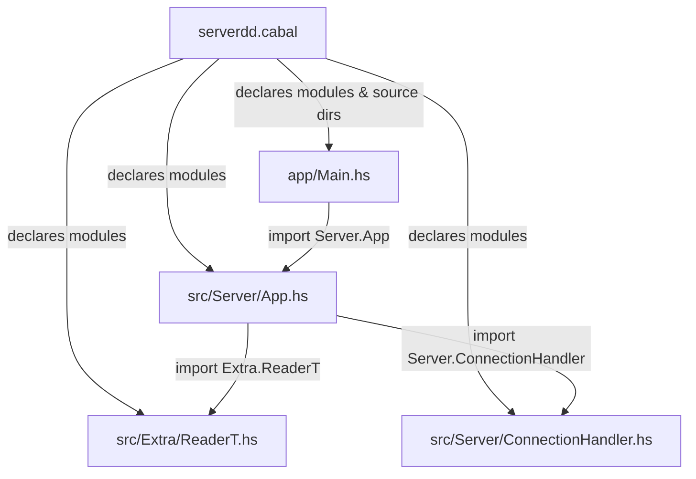
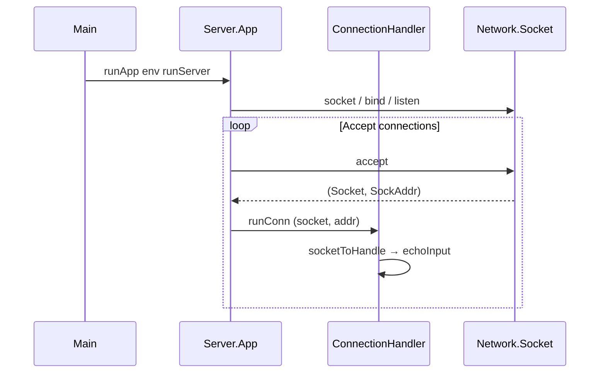

# serverdd — File Relations (Haskell)

> A Haskell TCP server for a chat.

## Project Layout

```
server/
├── server.cabal          ← Build config, declares modules & dependencies
├── server/
│   ├── app/
│   │   └── Main.hs         ← Entry point
│   └── src/
│       ├── Server/
│       │   ├── App.hs      ← Core application logic & types
│       │   └── ConnectionHandler.hs  ← Per-connection I/O
│       └── Extra/
│           └── ReaderT.hs  ← Custom ReaderT monad transformer
```

## File Dependency Graph



## File-by-File Breakdown

### `serverdd.cabal`

| Role | Build manifest |
|------|---------------|
| **Declares** | `Main.hs` (entry), `Server.App`, `Server.ConnectionHandler`, `Extra.ReaderT` |
| **Source dirs** | `serverdd/app` (for `Main.hs`), `serverdd/src` (for library modules) |
| **Dependencies** | `base`, `network`, `mtl`, `transformers` |

---

### `app/Main.hs`

| Role | Application entry point |
|------|------------------------|
| **Module** | `Main` |
| **Imports** | `Server.App` — uses `Env`, `defaultSocket`, `runApp`, `runServer` |

Creates an `Env` with the default socket configuration, then runs the server inside the `App` monad via `runApp`.

---

### `src/Server/App.hs`

| Role | Core application types and server lifecycle |
|------|---------------------------------------------|
| **Module** | `Server.App` |
| **Exports** | `App(..)`, `Env(..)`, `runApp`, `runServer`, `defaultSocket` |
| **Imports** | `Extra.ReaderT` — uses the custom `ReaderT` as the underlying monad transformer |
|             | `Server.ConnectionHandler` — calls `runConn` to process accepted connections |
|             | `Network.Socket` (external) — socket primitives |
|             | `Control.Monad.Reader.Class` (external) — `MonadReader`, `asks` |
|             | `Control.Monad.IO.Class` (external) — `MonadIO`, `liftIO` |

**Key types:**
- `App a` — a newtype over `ReaderT Env IO a`, deriving `Functor`, `Applicative`, `Monad`, `MonadReader Env`, `MonadIO`.
- `Env` — holds a `SocketConfig` record.
- `SocketConfig` — family, type, protocol, and address for the socket.

**Key functions:**
- `runApp` — unwraps `App` and runs the `ReaderT` with a given `Env`.
- `runServer` — builds a socket → starts listening → enters `mainLoop`.
- `mainLoop` — accepts a connection, delegates to `runConn`, and recurses.

---

### `src/Server/ConnectionHandler.hs`

| Role | Handles a single client connection |
|------|------------------------------------|
| **Module** | `Server.ConnectionHandler` |
| **Exports** | `runConn` |
| **Imports** | `Network.Socket` (external) — `Socket`, `SockAddr`, `socketToHandle` |
|             | `GHC.IO.Handle` / `GHC.IO.IOMode` / `GHC.IO.Handle.Text` (external) — handle-based I/O |

**Key functions:**
- `runConn` — converts a socket to a handle and calls `echoInput`.
- `echoInput` — reads a line from the handle and echoes it back.

> [!NOTE]
> This module currently implements a simple echo server. It is the future integration point for the chat protocol defined in `protocole.md`.

---

### `src/Extra/ReaderT.hs`

| Role | Custom `ReaderT` monad transformer |
|------|-------------------------------------|
| **Module** | `Extra.ReaderT` |
| **Exports** | `ReaderT`, `runReaderT`, `ask`, `lift` |
| **Imports** | `Control.Monad.Reader.Class` (external) — `MonadReader` typeclass |
|             | `Control.Monad.Trans.Class` (external) — `MonadTrans` typeclass |
|             | `Control.Monad.IO.Class` (external) — `MonadIO` typeclass |

Provides a from-scratch `ReaderT` implementation with instances for `Functor`, `Applicative`, `Monad`, `MonadReader`, `MonadTrans`, and `MonadIO`. Used by `Server.App` as the foundation for the `App` monad.

## High-Level Data Flow


